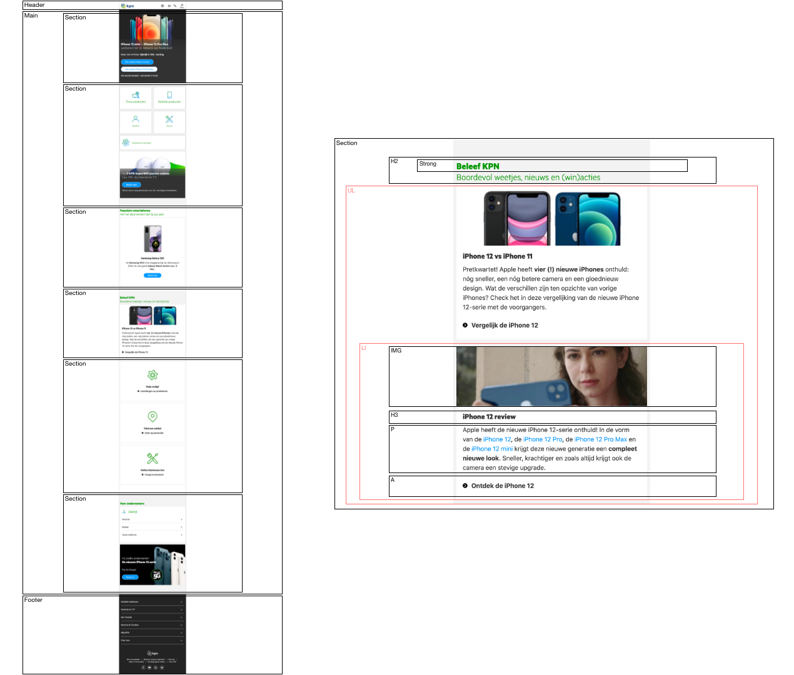

# Procesverslag
**Auteur:** Denzel Soehani

Markdown cheat cheet: [Hulp bij het schrijven van Markdown](https://github.com/adam-p/markdown-here/wiki/Markdown-Cheatsheet). Nb. de standaardstructuur en de spartaanse opmaak zijn helemaal prima. Het gaat om de inhoud van je procesverslag. Besteedt de tijd voor pracht en praal aan je website.

## Bronnenlijst
1. -bron 1-
2. -bron 2-
3. -...-

## Eindgesprek (week 7/8)

-dit ging goed & dit was lastig-

**Screenshot(s):**

-screenshot(s) van je eindresultaat-

## Voortgang 3 (week 6)

-same as voortgang 1-

## Voortgang 2 (week 5)

-same as voortgang 1-

## Voortgang 1 (week 3)

### Stand van zaken

Content toevoegen ging erg goed. Ik vind het soms moeilijk om overzicht te houden in mijn CSS, maar tot nu toe gaat dat oke.

**Screenshot(s):**

-screenshot(s) van hoe ver je bent met korte uitleg-

### Agenda voor meeting

| Denzel | Gerrit | Jessie | Micky | Cesar |
| --- | --- | --- | --- | --- |
|Selectoren |De dingen die ik wil uitwerken|Background-image|Breakdown schetsen|Desktop V1 ipv Telefoon V1|
|Navigatie |De uitbreiding naar responsive|Transitions tussen fixed en relative header op scrol|Flexbox|Alle content?|
|Orginele website aanpassen|Hoe neem ik huisstijl over|svg image|Lettertypes|Image size, Voorbeeld vorig jaar|

### Verslag van meeting

-na afloop snel uitkomsten vastleggen-

## Breakdownschets (week 1)

## Intake (week 1)
-uitwerken voor de kick-off werkgroep - begin van de eerste week-

**Je startniveau:** blauw

**Je focus:** surface plane

**Je opdracht:** kpn.com

**Screenshot(s) van de eerste pagina (small screen):**

**Screenshot(s) van de tweede pagina (small screen):**

